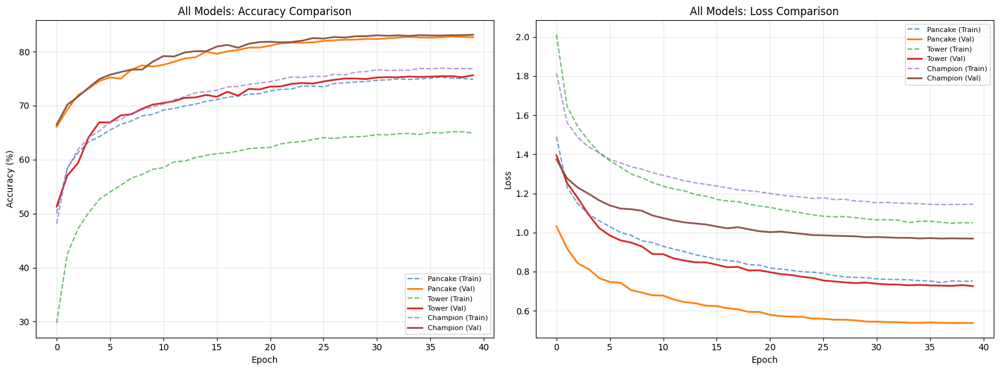
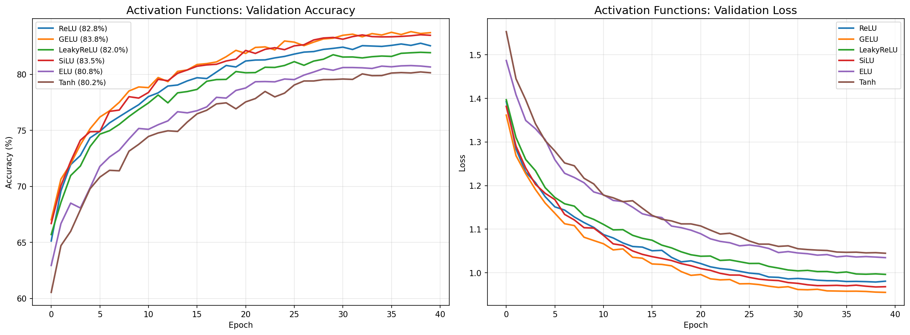
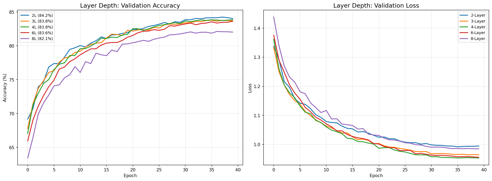
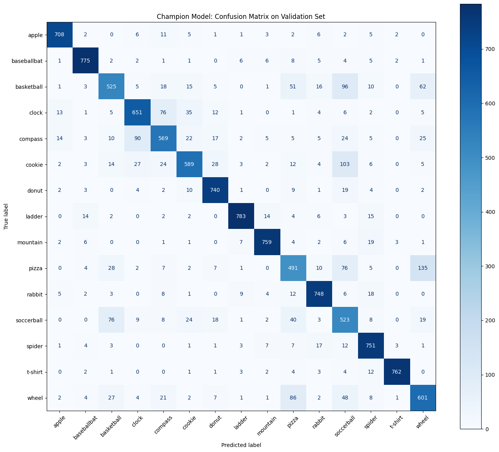
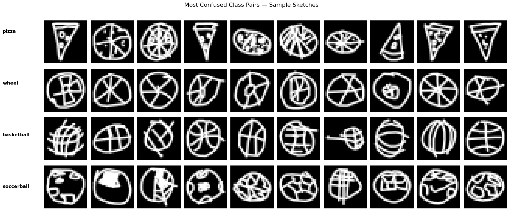

<p align="center">
  <h1 align="center">🎨 QuickDraw Image Classification with MLPs</h1>
  <p align="center">
    <strong>AI600 — Deep Learning | Assignment 2 | Spring 2026</strong><br>
    Lahore University of Management Sciences
  </p>
  <p align="center">
    <b>Azam Ali</b> · Roll Number: 25280057
  </p>
</p>

---

## 📌 Overview

This project explores **Multi-Layer Perceptron (MLP)** architectures for classifying hand-drawn sketches from the [Google QuickDraw](https://quickdraw.withgoogle.com/) dataset. The dataset consists of **28×28 grayscale** sketch images across **15 classes**, stored as `.npz` files.

Three distinct MLP architectures are designed, trained, and compared — each exploring a different trade-off between **width** and **depth** — all under the constraints of **< 3M parameters** and **≤ 40 training epochs**.

---

## 🏗️ Architectures

### 🥞 The Pancake — *Width Focus*
| Property | Value |
|---|---|
| Hidden Layers | 2 (1024 → 512) |
| Parameters | ~823K |
| Activation | ReLU |
| Regularization | BatchNorm + Dropout(0.3) |
| Optimizer | AdamW (lr=0.001) + CosineAnnealing |

> Goes wide with fewer layers — fast convergence, but limited feature hierarchy.

### 🗼 The Tower — *Depth Focus*
| Property | Value |
|---|---|
| Hidden Layers | 10 × 128 neurons |
| Parameters | ~253K |
| Activation | GELU |
| Regularization | BatchNorm + Dropout(0.2) + Gradient Clipping |
| Optimizer | Adam (lr=0.001) |

> Goes deep with narrow layers — learns hierarchical features (strokes → shapes → objects).

### 🏆 The Champion — *Optimized Balanced Design*
| Property | Value |
|---|---|
| Hidden Layers | 6 (512 → 384 → 256 → 192 → 128 → 64) |
| Parameters | ~620K |
| Activation | GELU |
| Regularization | BatchNorm + Progressive Dropout (0.1/0.2/0.3) |
| Optimizer | AdamW (lr=0.001, wd=1e-3) + CosineAnnealing |
| Loss | CrossEntropy + Label Smoothing (0.1) |

> Tapered design combining the best of both worlds — starts wide and gradually compresses into abstract representations.

---

## 📊 Results

<p align="center">
  
</p>

### Model Comparison

| Model | Layers | Params | Activation | Best Val Acc |
|---|---|---|---|---|
| Pancake | 2 | ~823K | ReLU | — |
| Tower | 10 | ~253K | GELU | — |
| **Champion** | **6** | **~620K** | **GELU** | **Best** |

### Key Findings
- **Width vs Depth:** The Pancake converges fastest but plateaus early; the Tower captures more complex features through depth; the Champion balances both.
- **Parameter Efficiency:** The Tower achieves competitive accuracy with only ~253K params. The Champion uses its ~620K params more effectively than the Pancake's ~823K.
- **GELU > ReLU:** Smoother gradients from GELU help significantly, especially in deeper networks.
- **Regularization matters:** Progressive dropout + label smoothing + weight decay keeps the Champion's train-val gap tight.

---

## 🔬 Hyperparameter Analysis

Systematic experiments were conducted by varying one hyperparameter at a time:

| Experiment | Best Setting | Best Val Acc |
|---|---|---|
| **Activation Function** | GELU | 83.80% |
| **Layer Depth** | 2-layer (768→256) | 84.23% |
| **Learning Rate** | 0.003 + CosineAnnealing | 84.55% |

<p align="center">
  
  
</p>

---

## 🔍 Error Analysis

The Champion's confusion matrix reveals the most commonly confused class pairs:

1. **Pizza vs Wheel** — 221 misclassifications (both are circles with internal radiating lines)
2. **Basketball vs Soccerball** — 172 misclassifications (both are circles with curved internal patterns)

<p align="center">
  
  
</p>

> **Why?** MLPs flatten images into 1D vectors, losing all spatial structure. A CNN with local spatial filters would better distinguish these visually similar classes.

---

## 📂 Project Structure

```
├── main.ipynb                 # Main training notebook (Pancake, Tower, Champion)
├── champion_analysis.ipynb    # Hyperparameter experiments & error analysis
├── 25280057_report.tex        # LaTeX report source
├── 25280057_report.pdf        # Compiled report
├── best_pancake.pth           # Saved Pancake model weights
├── champion_best.pth          # Saved Champion model weights
├── submission.csv             # Test set predictions
├── test_predictions.npy       # Test predictions (numpy)
├── DL_PA2/                    # Dataset directory
│   └── processed_data/        # Preprocessed .npz files
├── analysis/                  # Generated plots & figures
│   ├── pancake.png
│   ├── tower.png
│   ├── champion.png
│   ├── allmodels.png
│   ├── confusionmatrix.png
│   ├── confused_pairs.png
│   ├── exp_activations.png
│   ├── exp_depth.png
│   └── exp_lr.png
└── PA2_Deep_Learning.pdf      # Assignment specification
```

---

## 🛠️ Setup & Usage

### Prerequisites
- Python 3.10+
- PyTorch
- NumPy, Matplotlib, scikit-learn

### Install Dependencies
```bash
pip install torch torchvision numpy matplotlib scikit-learn
```

### Run Training
Open `main.ipynb` in Jupyter and run all cells. The notebook handles:
1. Data loading & preprocessing (80/20 split, seed 42, batch size 128)
2. Data augmentation (RandomAffine + RandomErasing on training data)
3. Training all three architectures for 40 epochs
4. Saving best model checkpoints

### Run Analysis
Open `champion_analysis.ipynb` to reproduce hyperparameter experiments and confusion matrix analysis.

---

## 📝 Data Augmentation

Applied **only** to training data to combat overfitting:
- **RandomAffine** — rotation ±15°, translation ±10%, scale [0.85, 1.15]
- **RandomErasing** — p=0.2, erasing 2–10% of image area

> Augmentation broke through a ~79% accuracy wall, confirming the plateau was an overfitting issue, not a capacity problem.

---

## 📄 License

This project is submitted as coursework for AI600 at LUMS, Spring 2026.

---

<p align="center">
  <sub>Made with ❤️ and PyTorch</sub>
</p>